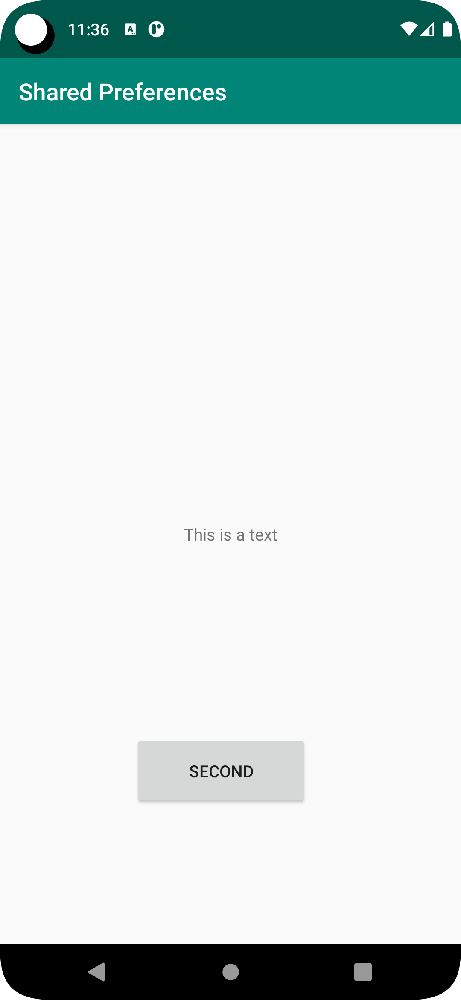
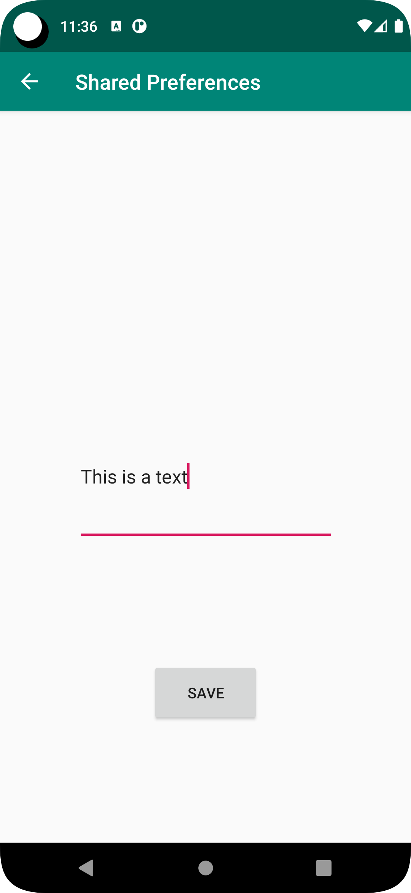

# Rapport Shared Preferences

**Skriv din rapport här!**

Först skapades aktiviteten Secondactivity. En knapp och en textView skapades och constaints sattes. 
I mainActivity skapades en EditText och en knapp. Här blev ordningen på sidorna fel och projektet 
började om från början. 

I SecondActivity skapades istället en EditText och en knapp. Constraints sattes på båda.
I MainActivity skapades en TextView och en knapp och constraints sattes. En koppling till vardera
layout-filer lades till.

Meningen är att man i Secondactivity ska kunna skriva in en text och sedan spara texten. När man sedan stänger ner appen eller
förflyttar sig till MainActivity ska texten visas i TextView. Knappen i MainView är till för att 
byta aktivitet till SecondActivity. Detta genomfördes genom att sätta en ButtonLIstener på Knappen i mainActivity
som när den triggas skapar ett nytt intent som startar SecondActivity.

I AndroidManifests.xml lades MainActivity till som en förälder till SecondActivity för att automatiskt få
en pil som tar användaren tillbaka till MainActivity.

För att lyckas spara texten I SecondActivity användes Shared Preferences vilket innebär att data sparas i det lokala 
minnet som en nyckel ihop med data. 

Ett objekt av typen SharedPreferences (identifierare: shared) deklarerades och ett annat av typen 
SharedPreferences.Editor (identifierare:editor)skapades för att kunna spara till SharedPreferences.
shared initierades i oncreate genom att hämta preferences genom metoden:
```
shared = getSharedPreferences("SHARED_PREF",MODE_PRIVATE);
```
Sedan skapades en metod för att spara data:
    Först initieras editor, metoden putString() används för att lägga till en sträng och
    nyckeln "Text" identifierar strängen.
    apply() skickar data tillbaka till SharedPreferences-Objektet.
```
public void saveToPreference(){

        editor = shared.edit();
        editor.putString("Text", text.getText().toString());
        editor.apply();
        Log.d("hej", "Applied: "); 
    }
```
I SecondActivity lades en buttonListener till dess knapp och metoden SaveToPreference() anropas när 
den triggas.

I mainActivity deklarerades ett till SharedPreferences objekt (identifierare: Myref) som initieras på samma sätt som i 
SecondActivity. Här skapas dock ingen editor eftersom objektet aldrig ska skrivas till här.
I Main-Aktivitetens TextView sätts texten till den hämtade strängen från SharedPreferences-objektet. Notera att
detta sker i Metoden onResume som körs varje gång appen återupptas och att nyckeln för strängen i SecondActivity.
"empty" innebär texten som står ifall den hämtade strängen inte skulle finnas.
:

```
     @Override
    protected void onResume() {
        super.onResume();

        viewText.setText(myRef.getString("Text","empty"));

    }
```





